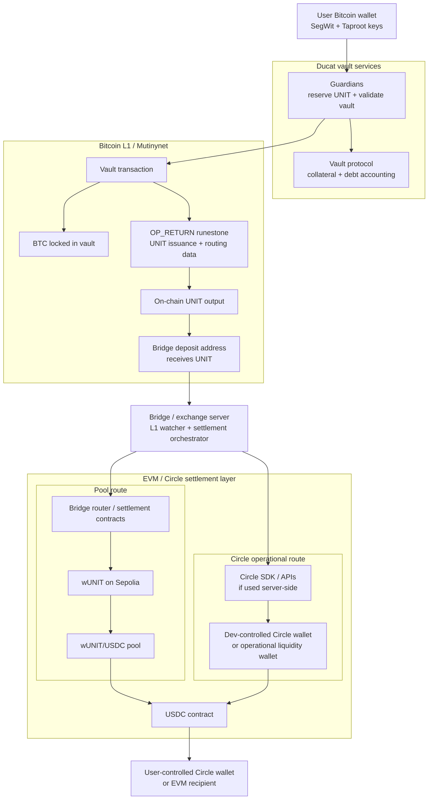
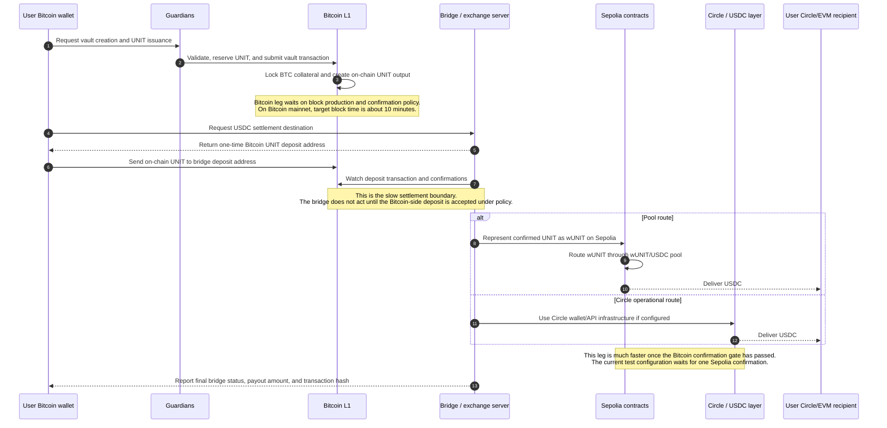

# Ducat BTC/UNIT to USDC Settlement Brief

Status: Circle review draft, verified against the current implementation and Sepolia bridge health endpoint on 2026-05-07. This is a product and technical architecture brief, not legal advice.

## Executive Summary

The canonical product flow is simple: a Bitcoiner brings BTC and receives USDC.

UNIT is used inside the Ducat protocol to account for the vault position and bridge settlement, but in this BTC-to-USDC flow the user should not experience UNIT as a separate product or as a standing 1:1 swap with USDC. The user-facing experience should be framed as BTC-backed vault issuance with automatic USDC settlement.

## What UNIT Is, And What It Isn't

UNIT is the on-chain debt token of the Ducat vault protocol. When a user opens a vault, UNIT is created on-chain against locked BTC collateral. When the user closes the vault by repaying, UNIT is destroyed. UNIT exists as a function of an open Ducat vault position and the corresponding BTC collateral.

UNIT is not designed or presented as a fiat-backed payment stablecoin. It is overcollateralized debt issued against BTC collateral, structurally analogous to CDP debt systems such as MakerDAO's DAI or Liquity's LUSD rather than to reserve-backed fiat stablecoins. Its stability mechanism is collateral, liquidation, and on-chain market arbitrage. There is no fiat reserve backing UNIT, and users do not hold a balance-sheet claim against Ducat or Circle for par redemption.

The wUNIT/USDC pool prices wrapped UNIT against USDC based on pool inventory, liquidity, and demand. It is not a fixed redemption facility, and it should not be described as creating a standing 1:1 UNIT-to-USDC product.

This distinction matters for Circle review. USDC is a reserve-backed payment stablecoin. UNIT is BTC-collateralized on-chain debt. The product and support language should preserve that distinction: in the canonical flow, the user is receiving USDC from a BTC-backed Ducat vault settlement, not buying a synthetic version of USDC on Bitcoin.

Regulatory positioning should be reviewed by counsel, but the intended distinction is straightforward: payment-stablecoin frameworks such as the U.S. GENIUS Act focus on tokens used for payment or settlement that are redeemable at a fixed monetary value and backed by issuer reserves. UNIT is debt minted against BTC collateral inside a vault protocol. It should therefore be presented as BTC-collateralized vault debt, not fiat e-money, not a USDC wrapper, and not a Ducat or Circle promise to redeem at par from reserves.

## Current Protocol Flow

The current implementation supports a coordinated vault-to-USDC flow. The user's Bitcoin wallet is the source of the Bitcoin-side actions: it signs the vault transaction that locks BTC and later signs the UNIT transfer into the settlement path. The user's BTC is locked in a Bitcoin vault. Against that vault, UNIT is created on-chain through the Ducat protocol, with issuance and routing data encoded in the Bitcoin transaction using OP_RETURN runestone data.

After the vault transaction is created, the settlement flow opens a bridge request with the bridge/exchange server. The bridge server returns a one-time Bitcoin deposit address. Once the on-chain UNIT output from the vault can be spent, the user's Bitcoin wallet signs and broadcasts a UNIT transaction to that bridge deposit address. From the user's perspective, this is still one BTC-to-USDC settlement flow; the UNIT leg is protocol plumbing inside the workflow.

The bridge/exchange server watches Bitcoin for the UNIT deposit. After the required Bitcoin confirmation policy is satisfied, the bridge side represents the confirmed UNIT on Sepolia as wUNIT. That wUNIT is then routed through the wUNIT/USDC pool so the final payout asset is USDC. If Circle wallet or API infrastructure is used, it sits on the server side of this settlement layer rather than inside the user's Bitcoin wallet.

The user's Bitcoin wallet does not call Circle directly. The exact Circle-side execution path, for example Circle SDK transfer, EVM signer transfer, dev-controlled Circle wallet transfer, or a combination, is handled by the bridge/exchange server.

The current test environment uses Mutinynet on Bitcoin and Sepolia on EVM. The settlement flow waits long enough for Bitcoin confirmation, bridge detection, EVM execution, and one Sepolia confirmation. The bridge server is responsible for deciding when a Bitcoin deposit has enough confirmation to act.

There are two settlement branches after the Bitcoin-side UNIT deposit is confirmed:

- **Pool route:** the bridge/exchange server represents confirmed UNIT as wUNIT on Sepolia, routes wUNIT through the wUNIT/USDC pool, and delivers USDC from the USDC contract to the user's recipient.
- **Circle operational route:** the bridge/exchange server uses Circle SDK/API infrastructure and a dev-controlled Circle or operational liquidity wallet to deliver USDC to the user's recipient. This route is server-side and operational; the user does not interact with Circle APIs directly from the Bitcoin wallet.

## System Map

## Data Flow And Settlement Timing

This swimlane view shows where the slower Bitcoin confirmation leg sits relative to the faster EVM settlement leg. Time flows from top to bottom.

## Flow 1: BTC In, USDC Out

This is the canonical flow for a user who wants dollars from BTC.

1. The user chooses how much BTC to use and selects USDC as the payout.
2. Ducat creates a vault transaction on Bitcoin. BTC is locked as collateral, and UNIT is created on-chain against that vault using OP_RETURN runestone data.
3. The settlement flow creates a bridge request for the USDC payout and receives a one-time Bitcoin deposit address from the bridge server.
4. Once the issued UNIT can be spent, the user's Bitcoin wallet sends that UNIT to the bridge deposit address. This is hidden inside the coordinated BTC-to-USDC process.
5. The bridge server watches Bitcoin and waits for the required Bitcoin confirmation before acting.
6. After Bitcoin confirmation, the bridge server follows one of two settlement branches: the wUNIT/USDC pool route or the Circle operational route.
7. The user receives USDC at their Circle wallet or EVM recipient address.
8. The settlement flow reports the final payout amount and transaction hash once the bridge server marks the operation complete.

The precise wording matters: this should not be described as a public 1:1 UNIT-to-USDC product. It is better described as BTC-backed vault issuance with automatic USDC settlement.

## Flow 2: UNIT In, USDC Out

This is a separate path for a user who already holds UNIT and chooses to bridge it to USDC.

1. The user enters a UNIT amount and selects USDC.
2. The bridge server gives the user a one-time Bitcoin deposit address.
3. The user signs a normal UNIT transfer to that deposit address.
4. The bridge server waits for Bitcoin confirmation.
5. The bridge server settles on EVM and delivers USDC to the user's Circle wallet or EVM recipient.
6. The bridge status and final USDC payout are shown once the bridge server reports completion.

This flow is more sensitive from a product and regulatory perspective because the user is explicitly moving UNIT into USDC. It should be positioned separately from the BTC-to-USDC flow.

## Settlement Timing

| Step | What happens | User sees |
| --- | --- | --- |
| Bitcoin vault transaction | User signs, BTC is locked, UNIT is created on-chain against the vault | Creating vault |
| Internal bridge send | User Bitcoin wallet sends the internal UNIT leg to the bridge deposit address | Preparing settlement |
| Bitcoin confirmation | Bridge waits for the Bitcoin deposit to confirm before acting | Waiting for USDC settlement |
| EVM/Circle settlement | Bridge completes the USDC leg | Waiting for USDC payout |
| Completion | USDC reaches the user recipient | Settlement complete |

Current testnet behavior uses Mutinynet and Sepolia. The settlement flow waits long enough for one Bitcoin confirmation, bridge detection, Sepolia execution, and one Sepolia confirmation. Production timing should be described as "after Bitcoin confirmation plus EVM settlement," not as a fixed number of minutes.

## Roles And Responsibilities

The user controls their Bitcoin wallet and their destination Circle/EVM recipient.

The user's Bitcoin wallet signs the Bitcoin-side transactions. It should not custody funds on behalf of the user.

Guardians operate the Bitcoin-side vault protocol and participate in vault validation and execution.

The Ducat bridge/exchange server operates the cross-chain settlement process: bridge requests, Bitcoin monitoring, confirmation policy, EVM settlement, operational liquidity, and Circle API/wallet integration if used.

Circle provides USDC and wallet/API infrastructure where integrated. Circle should not be represented as operating the Bitcoin vaults, operating Guardians, guaranteeing UNIT parity, or underwriting the Bitcoin-side protocol.
